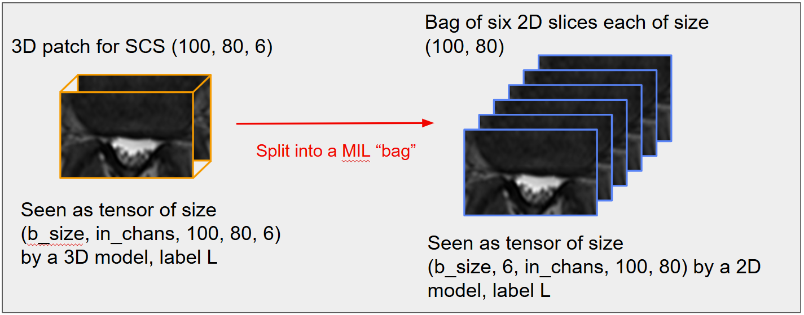
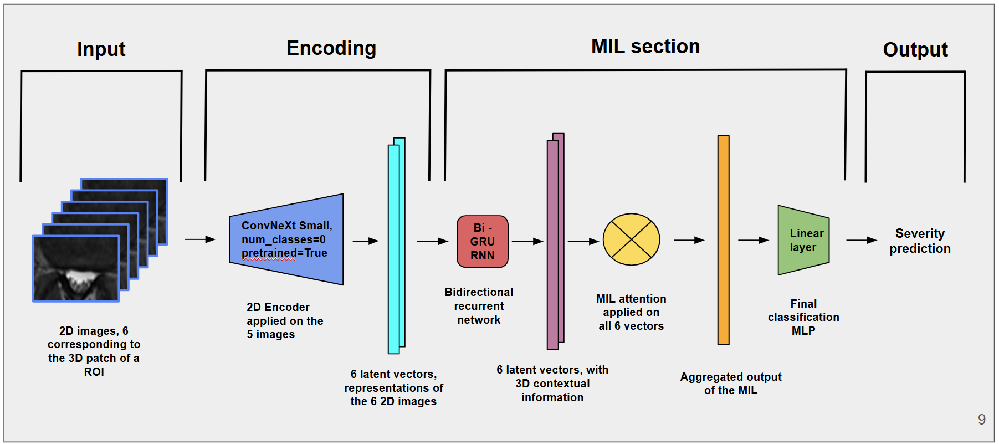

# Team Neuropoly: RSNA 2024 Lumbar Spine Degenerative Classification Challenge

This branch of the repo uses the data obtained from the preprocessing pipeline to train classification models to predict the severity of the pathologies. 

We first preprocess the data for each pathology in each "prepare" file as follows : 
- we start from a defined 3d pacth (constant physical size)
- we resample it and apply different random transforms for data augmentation
- finally we create a bag of 2d slices for the MIL architecture :

Then we train models using each "train" files, for each pathology, training functions are in training_utils.py, and model definition is in mil_definition.py. 

The models have the following architecture : 

Images are encoded into latent vectors, then processed iteratively through a bidirectional RNN. Finally an attention layer outputs a wieghts, allowing us to sum the vectors with thoses normalized weights, before outputing a severity prediction.